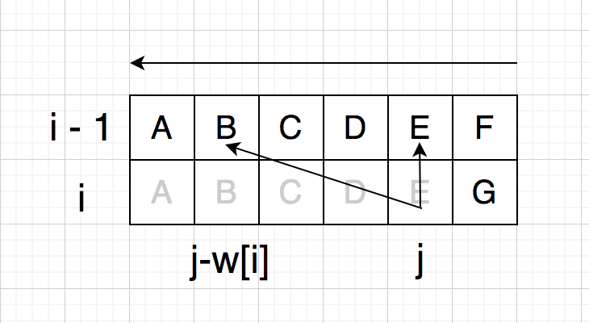
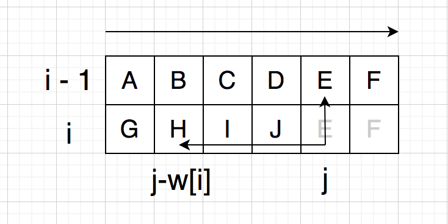

## 动态规划三要素
- 最优子结构
- 状态转移方程
- 边界

## 背包问题
### 01 背包
每种物品只有一个。

DP[i][j] (容量为 j 的背包存放前 i 件物品的最大价值) 最优子结构：
- DP[i - 1][j] (不放第 i 件物品)
- DP[i - 1][j - w[i]] + v[i] (要放第 i 件物品)

状态转移方程：DP[i][j] = Max(DP[i - 1][j], DP[i - 1][j - w[i]] + v[i])

边界：DP[0][X] = DP[X][0] = 0 (不放任何物品或者背包容量为 0)

时间复杂度：O(n * m)

空间优化：第 i 行只依赖于第 i-1 行，需要从后往前更新，避免先覆盖了 DP[i - 1][j - w[i]]，优化后空间复杂度 O(m)

### 完全背包
每种物品有**无限**个。

DP[i][j] 最优子结构：
- DP[i - 1][j]
- DP[i][j - w[i]] + v[i] (放第 i 种物品后还可以继续放这种物品)

状态转移方程：DP[i][j] = Max(DP[i - 1][j], DP[i][j - w[i]] + v[i])

空间优化：第 i 行依赖于第 i-1 行和第 i 行前面的元素，故需要从前往后更新，优化后空间复杂度 O(m)

### 多重背包
每种物品有**多个**。

将每种物品拆分成多个单件，转化为 01 背包问题。

拆分算法：k = 20 + 21 + ... + 2c-1 + (k - 2c + 1)

例如：5 = 1 + 2 + 2，将数量为 5 的物品拆分成 3 个单件，分别聚合了原先的 1，2，2 件物品，可以分别组合出原先的 1，2，3，4，5 件物品。

## 注意
1, 当包含两个变化维度时，一般用下标 0 表示空状态而不是第一个元素
