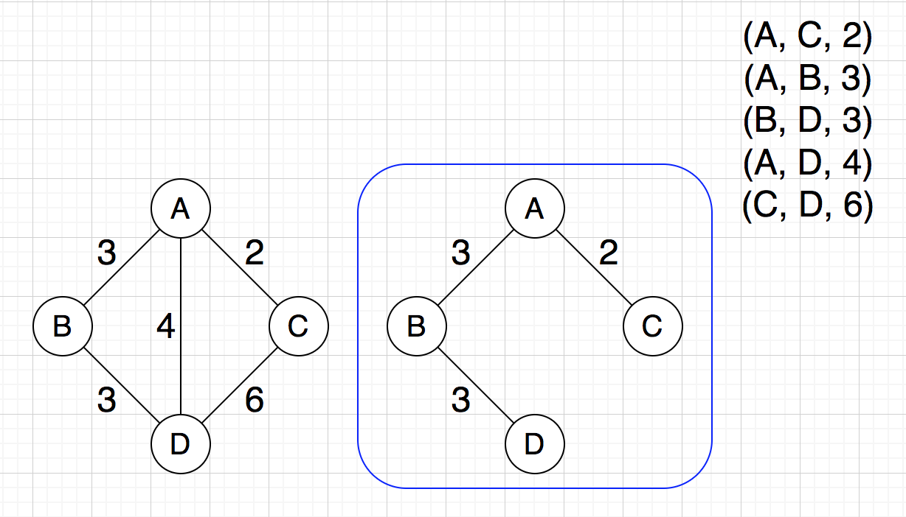

## [并查集](../disjoint-set/disjoint_set.cpp)

## 连通图
利用并查集，对有边相连的节点进行合并，求出连通分量。连通分量等于 1 的为连通图，大于 1 的为非连通图。

## 最小生成树
生成树：连通图的极小连通子图。

最小生成树：生成树中权值最小的。

常用算法：
- Kruskal Algorithm (ElogE)
- Prim Algorithm (V ^ 2)
- Prim + Heap (ElogV)

### Kruskal Algorithm
利用并查集，对所有的边按权值从小到大进行遍历。如果该边连接的两个顶点不属于同一个集合，则选中该边并且合并这两个顶点，否则跳过该边。

