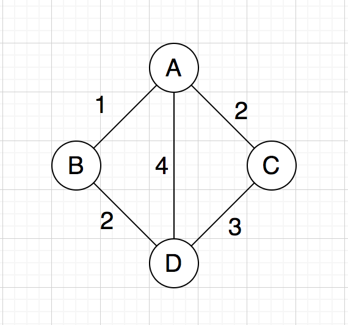
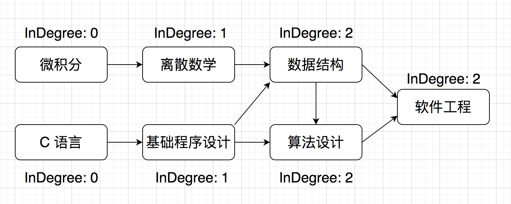
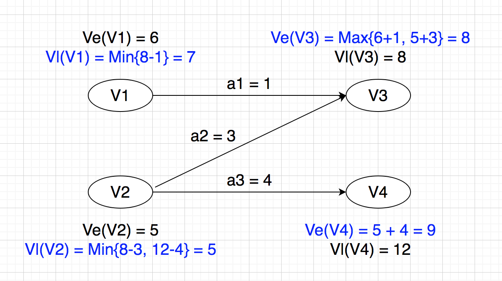
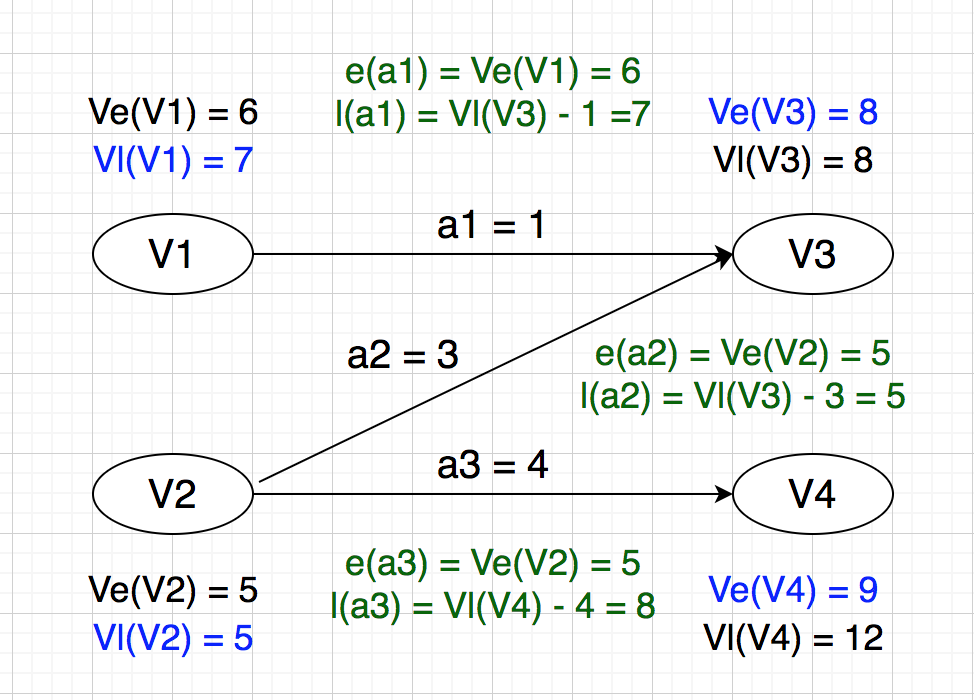
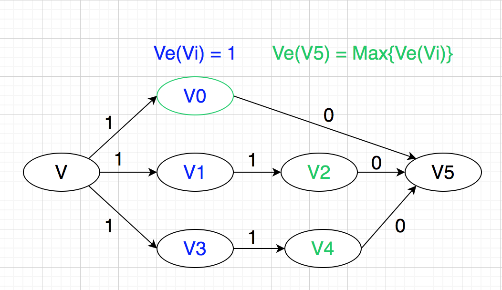

## [并查集](../disjoint-set/disjoint_set.cpp)

## 连通图
利用并查集，对有边相连的节点进行合并，求出连通分量。连通分量等于 1 的为连通图，大于 1 的为非连通图。

## 最小生成树
生成树：连通图的极小连通子图。

最小生成树：生成树中权值最小的。

常用算法：
- Kruskal Algorithm (ElogE)
- Prim Algorithm (V ^ 2)
- Prim + Heap (ElogV)

### Kruskal Algorithm
利用并查集，对所有的边按权值从小到大进行遍历。如果该边连接的两个顶点不属于同一个集合，则选中该边并且合并这两个顶点，否则跳过该边。

## 最短路径问题
### Dijkstra Algorithm
采用动态规划的思想：
- 状态转移方程：minD(D) = Min{minD(A) + <A, D>, minD(B) + <B, D>, minD(C) + <C, D>}
- 边界：minD(源点) = 0

每次都选择当前未访问顶点中 minD 数组值最小的顶点 v，将其标记为已访问（因为不可能再有通过其他顶点到达 v 且 minD 值更小的），并更新 v 指向的所有未访问顶点的 minD 值。

时间复杂度：O(V ^ 2)

|         | A | B   | C   | D   |
| ------- | - | --- | --- | --- |
| 初始值   | 0 | INF | INF | INF |
| A 松弛后 | 0 | 1   | 2   | 4   |
| B 松弛后 | 0 | 1   | 2   | 3   |
| C 松弛后 | 0 | 1   | 2   | 3   |
| D 松弛后 | 0 | 1   | 2   | 3   |

### Dijkstra + Heap
选择离源点最近的点，可以使用优先队列进行优化。

优化后时间复杂度：O(ElogV)

## 拓扑排序
针对 AOV(Activity on Vertex) 网，不带权值的有向无环图，将图中顶点排成线性序列。

例如：推荐学习顺序: 微积分 -> C 语言 -> 离散数学 -> 程序设计 -> 数据结构 -> 算法设计 -> 软件工程

算法思路：

1，每次取出当前图中入度为 0 的顶点

2，从图中删除该顶点以及它的出边

## 关键路径
针对 AOE(Activity on Edge) 网，带有权值的有向无环图，求源点到汇点的最长路径。

事件 Vj 的最早开始时间 Ve(j)

- Ve(源点) = 0

- Ve(j) = Max{Ve(j), Ve(i) + weight(i, j)}  (i 是 j 的前序事件，只有所有前序事件都完成了，Vj 才可以开始)

事件 Vj 的最晚开始时间 Vl(j)

- Vl(汇点) = Ve(汇点)

- Vl(j) = Min{Vl{j}, Vl(k) - weight(j, k)} (k 是 j 的后序事件，Vj 再晚也要迁就所有后序事件中最晚发生的最小值)

活动 aj 的最早开始时间 e(j) = Ve(前序事件)

活动 aj 的最晚发生时间 l(j) = Vl(后序事件) - aj

## [指令编排](./instrction_arrnagement.cpp)
抽象成关键路径问题：

- 顶点表示某条指令执行结束，边表示两条指令之间的安全距离(两条指令开始执行时间的差值)

- 所有入度为 0 的顶点的最早开始时间 Ve(Vi) = 1

- 虚拟汇点的最早开始时间（即题目所求最短执行时间），等于所有顶点的最早开始时间的最大值

