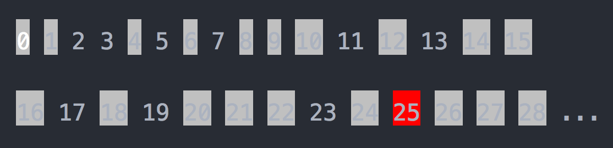
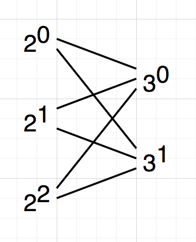
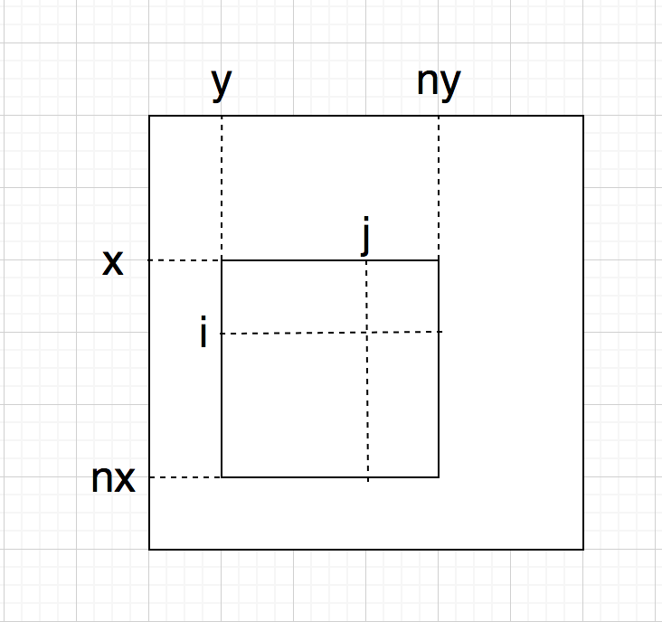

## 进制转换
- 10 -> N: 除 N 取余，逆序输出
- M -> 10: 对每个数位循环计算 d * m + s[i]
- M -> N: M -> 10, 10 -> N

## 最大公约数(Greatest Common Divisor, GCD)
辗转相除法(欧几里得算法)
### 举例
GCD(3139, 2117) = 73
```
1) 3139 % 2117 = 1022
2)        2117 % 1022 = 73
3)               1022 % 73 = 0
```

### 证明
GCD(a, b) = GCD(b, r) = g
```
a = g * l     |
b = g * m     | --> | g * l = g * m * k + r  
a = b * k + r |     | r = g * (l - m * l)
```

## 最小公倍数(Least Common Multiple, LCM)
LCM(a, b) = a * b / GCD(a, b)

## 素数
### n 是否为素数
只需判断 2 ~ sqrt(n) 的数能否被 n 整除即可。

因为 n 的约数是成对出现的，如果有大于 sqrt(n) 的数能被 n 整除，则必有小于 sqrt(n) 的数能被 n 整除。

### [0, n] 有哪些是素数
素数筛法：将素数的倍数标记为非素数，因为任何合数都可以进行质因子分解。



### 质因子分解
短除法：从最小的质数 2 开始，不断地除以质数直至结果为 1。

例如：120 = 2<sup>3</sup> * 3<sup>1</sup> * 5<sup>1</sup>

```
  2 |__120__
     2 |__60__
       2 |__30__
         3 |__15__
           5 |__5__
                1
```

**数 n 最多只能有一个大于 sqrt(n) 的质因子**。(反证法：如果有两个，则乘积大于 n)

### 约数的个数
若 n = p1<sup>e1</sup> * p2<sup>e2</sup> * ... * pn<sup>en</sup>, 则 ω(n)) = (e1 + 1) * (e2 + 1) * ... * (en + 1)

例如：12 = 2<sup>2</sup> * 3<sup>1</sup>, 则 ω(12) = (2 + 1) * (1 + 1) = 6



## 快速幂(O(log n))
任意正整数 n 都可以表示成：n = 2<sup>i</sup> + 2<sup>j</sup> ... + 2<sup>n</sup>

例如：29<sub>(2)</sub> = 11101 = 2<sup>4</sup> + 2<sup>3</sup> + 2<sup>2</sup> + 2<sup>0</sup>

则 x<sup>n</sup> = x<sup>2<sup>i</sup></sup> * x<sup>2<sup>j</sup></sup> * ... * x<sup>2<sup>n</sup></sup>

## [矩阵旋转](./operation_on_matrix.cpp)


