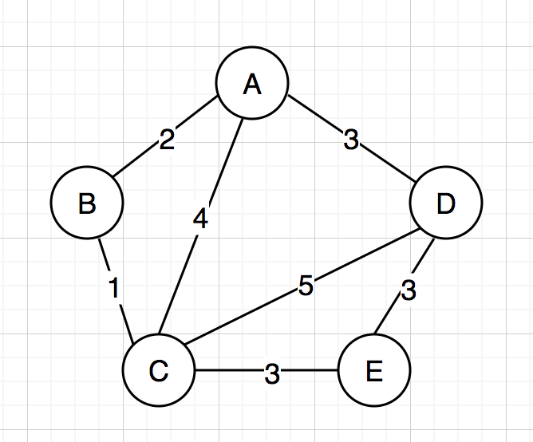
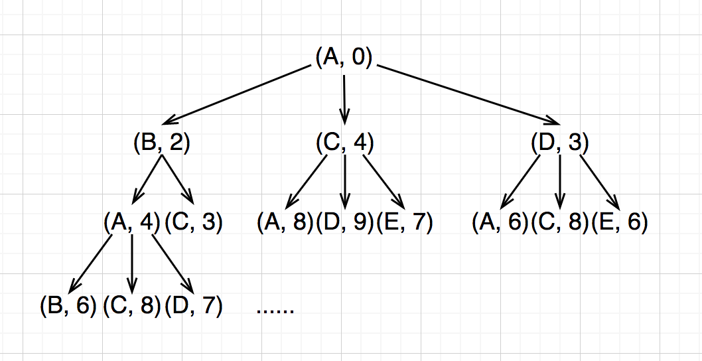

## 搜索
### 定义
起始状态经过一系列的状态转移抵达目标状态的过程

### 术语举例

#### paths from A to E
- 状态空间：所有点
- 状态转移：转向邻接点
- 起始状态：A
- 目标状态：E

#### paths from A to E with lowest cost
- 状态空间：(point, cost)
- 状态转移：转向邻接点并增加花费
- 起始状态：(A, 0)
- 目标状态：(E, lowest cost)

### 搜索树

### 搜索算法
- 广度优先遍历(BFS)
- 深度优先遍历(DFS)
