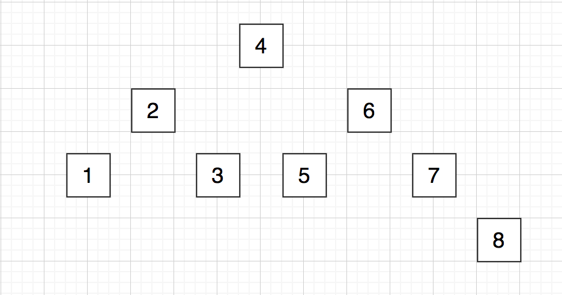
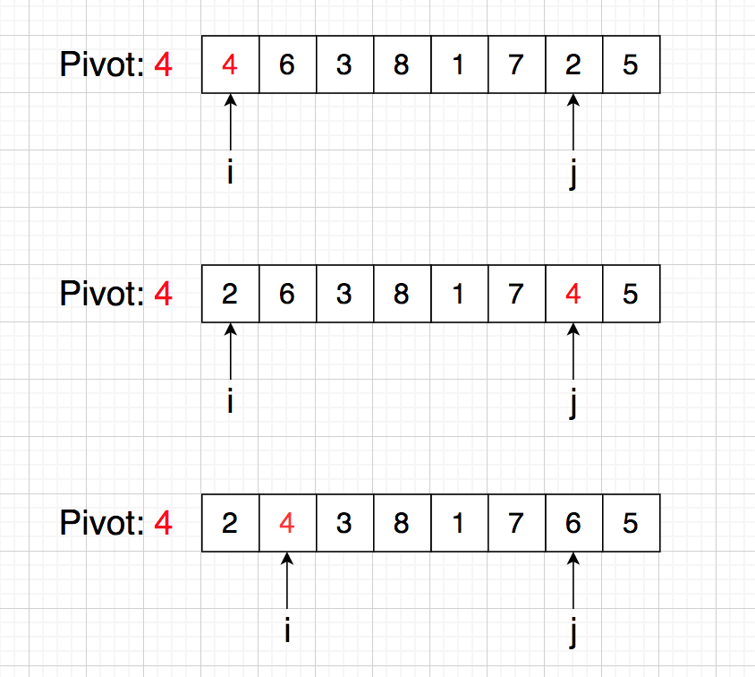

## 线性排序
任何基于比较的排序算法的时间复杂度下限是 O(NlogN)，要想实现线性时间内的排序，需要对数字的范围加以限制。

采用计数排序，以空间换时间，时间复杂度 O(n + r) (r: 数字的范围)

## 归并排序
将两个有序序列合并成一个更大的有序序列，递归进行，时间复杂度：O(NlogN)


## 快速排序
随机选择一个元素作为 pivot，在一次 Partition 过程中，将小于 pivot 的元素放到 pivot 左边，将大于 pivot 的元素放到 pivot 右边，pivot 确定最终位置；

左右部分不断递归下去，时间复杂度：O(NlogN)。

如果序列局部有序，选择第一个元素作为 pivot 的话，会导致递归树向一边倾斜，时间复杂度退化到 O(n ^ 2)，故随机选择元素作为 pivot。

例如原序列：8  6  3  4  1  7  2  5





## 逆序数对
```
原序列：    2  8  0  3  4
逆序对：    (8, 4) (8, 3) (8, 0) (2, 0)
逆序数：    4
```

利用归并排序，在任一 Combine 过程中，可以统计前面的有序序列和当前 j 指向元素构成的逆序数，不断递归累加。


## 第 k 大数
