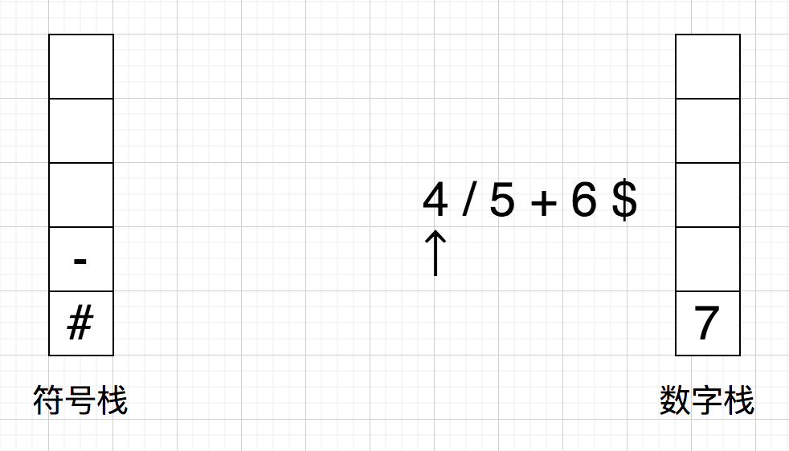

## 中缀表达式求值
遍历表达式，遇到数字，则压入数字栈；遇到运算符，则弹出符号栈中优先级 >= 当前运算符的符号进行计算，计算结果压入数字栈，再将当前运算符压入符号栈。

在表达式前面加上字符 '#'，优先级最低，则在弹出符号时就不用进行符号栈判空了，类似于哨兵。

在表达式后面加上字符 '$'，优先级小于算术运算符，能保证遍历完表达式后所有运算结束；优先级大于 '#'，能避免进行无效的 '#' 运算。

!!! 注意在获取数字时数字可能有多位

例如：1 + 2 * 3 - 4 / 5 + 6

